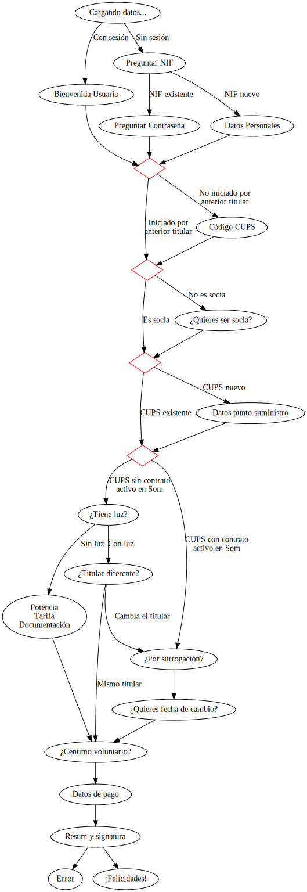

## Wizard Pages

0. Origenes
	- Contratar la luz desde la pagina web
		- No aporta info
	- Invitacion a no socio de un socio
		- Sabemos el socio vinculado $MEMBERNAME
	- Intercoop
		- Sabemos el socio vinculado $MEMBERNAME
		- Sabemos los datos del titular $NIF
	- Invitacion a cambiar titular del antiguo titular
		- Sabemos el CUPS $CUPSADDRESS
		- Si lo ha escogido así, sabemos el socio vinculado $MEMBERNAME
			- TODO: Confirmar que esta opcion les parece bien
		- Lectura y fecha del cambio
		- Surrogacion o no
			- TODO: Hasta donde decide el antiguo titular o el nuevo
	- Contratar la luz desde la OV o ya logeado
		- Sabemos el titular $NIF

1. **LoadingPage**:
	- *Al entrar:* Se detecta
		- si hay una sesion del CAS abierta (Decidim, OV), y se carga la info
			- $NAME, $ISMEMBER, $NIF
		- si hay token en la URL (invitacion, OV, intercoop), y se carga la info
			- $CUPSNAME (traspaso), $CUPS (traspaso), $MEMBERNAME (apadrinamiento, intercoop), $NIF, $NAME... (intercoop) 
	- "# Formulario de contratación"
	- Hasta que recuperemos la info de token y de sesión:
		- "Por favor, espere mientras se cargan los datos..."
	- Si viene con token de traspaso:
		- "Le han invitado a poner a su nombre el contrato de: $CUPSADDRESS"
	- Si viene con token de apadrinamiento:
		- "El socio $MEMBERNAME le ha invitado a contratar la luz con nosotros sin ser socio."
	- Si viene con token de intercoop:
		- "El titular de este nuevo contrato serà $NAME."
		- "Accedes por convenio de intercooperación con $MEMBERNAME."
		- TODO: Que hacer si $NIF ya existe
	- Si se detecta sesion abierta (CAS o OV)
		- "El titular de este nuevo contrato serà $NAME."
		- "Si eso no es correcto, por favor, cierre la sesión con dicho usuario (enlace)."
		- Desbloqueo: cuando se comprueba que hay sesion
	- Si no se detecta sesion abierta (CAS o OV)
		- "Por favor, introduzca el NIF del titular del nuevo contrato [   ]"
		- Se valida el NIF según se va entrando
		- La validación aporta si es valido y si existe (usuario activo en SOM)
		- *Desbloqueo:* Cuando el nif es uno válido

1. **PasswordPage**: Identifíquese
	- **skipif:** `sessionExists || ! knownVat`
	- "Bienvenido '$NIF' introduce la contraseña"
	- "Contraseña []"
	- "[Olvidé la contraseña]()"
	- Accion: Valida la contraseña y se recoge la información (nombre, si es socio.
		- Si no valida, mensaje de error y no se avanza

1. **PersonalDataPage**: Datos personales
	- **skipif:** `sessionExists || knownVat`
	- *Entra:* Si no había sesion y el NIF indicado no existe. `!sessionExists && !knownVat`
	- "Introduzca los datos del titular con NIF $NIF"
	- ...
	- TODO: La contraseña a posteriori?

1. **CupsCodePage**:
	- **skipif:** `transferToken`
	- "Identifique el punto de suministro"
	- "Código CUPS: []"
	- El CUPS se valida mientras se va introduciendo.
	- La validacion aporta $CUPSSTATUS y si esta disponible un $CUPSADDRESS
	- Según $CUPSSTATUS:
		- invalido: "El código CUPS no valida"
		- nuevo: "No disponemos de los datos de este punto de suministro; siga para introducirlos"
		- inactivo: "El código CUPS corresponde a la dirección $CUPSADDRESS"
		- enprocesoatr: "El punto de suministro tiene un proceso pendiente en Som Energia"
		- activo: "El código CUPS corresponde a la dirección $CUPSADDRESS. Se procede a hacer un cambio de titular."
		- disponible: "El código CUPS corresponde a la dirección $CUPSADDRESS"
	- *Continua:* Si $CUPSSTATUS es nuevo, activo o disponible
	- *Al salir:* Si $CUPSSTATUS es activo, es traspaso

1. **BecomeMemberPage**:
	- **skipif:** `isMember`
	- Casos:
		1. `inviteToken`: Si le ha invitado alguien:
			- "La contratación en SE requiere ser socia de la cooperativa."
			- "En tu caso **no es necesario** por que te ha invitado $MEMBERNAME pero te damos la opción de serlo si marcas la opción.
			- "Ser socio comporta una aportacion única de 100€ que se retorna al dejar de serlo."
			- "[ ] Acepto ser persona socia de la cooperativa y el pago de la participación."

		1. `!inviteToken && !activeCups`: Si no es invitado y no es un cambio interno de titular:
			- "Para poder contratar, ha de ser socio o haber recibido una invitación de uno".
			- "En cambios de titular, Som Energia dará de baja el contrato si en un año no está vinculado a un socio, o incluso antes en caso de incumplimiento contratual."
			- "Opcionalmente, puedes convertirte ya en socio:"
			- "[ ] Acepto convertirme persona socia de la cooperativa **mediante el pago de la aportación de 100€**."
			- Validate: Tiene que aceptar por narices

		- Poderlos bajar si no cumple
		- Que se lo vayan mirando y se p

		1. `!inviteToken && activeCups`: Si no es invitado pero es un cambio interno de titular:

			- "La contratación en SE ha de estar vinculada a una socia de la cooperativa."
			- "Despues de un año, se te dará la opción de entrar en la cooperativa o pasar a la comercializadora del monopolio de tu zona."
			- "[ ] Me quiero hacer socio ya sin esperar a un año, y acepto el pago de la participación."

1. **NewCupsPage**:
	- *Entra:* Si es un CUPS nuevo
	- "Datos del punto de suministro"
	- ...

1. **HasSupplyPage**:
	- *Entra:* Si el CUPS no esta activo en SE
	- "¿Hay luz en el punto de suministro?"
	- "() No, será necesario dar de alta el suministro"
	- "() Si, ya hay luz, sólo quiero cambiar la comercializadora"
	- Si no, es alta

1. **TechnicalDataPage**:
	- *Entra:* Si es alta
	- "Datos de suministro:"
	- Potencia/tarifa
	- Documentacion de alta

1. **NewOwnerPage**:
	- *Entra:* Si no es alta y no es CUPS activo:
	- "¿Hasta ahora el contrato de este punto de suministro estaba tambien a nombre de $NAME?"
	- "( ) Si. Se matiene la misma titularidad."
	- "( ) No. Comportará un cambio de titular."
	- "Atención: Si no se informa correctamente de esto, la distribuidora rechazará el cambio"
	- Si se informa que no, se activa el flag de cambio de titular, como si fuera una invitacion a cambio o el cups estuviera activo

1. **SurrogationPage**:
	- *Entra:* Si hay un cambio de titular (indicado, invitacion o detectado cups activo):
	- TODO: Que tiene que decir el antiguo titular aqui?
	- "¿Que método quieres para hacer el cambio?"
	- "( ) Subrogación: el nuevo titular acepta las posibles deudas pendientes del anterior contrato."
	- "( ) No subrogación: el nuevo titular pagará la fianza de la distribuidora."

1. **SwitchChange**:
	- *Entra:* Si es un cambio de titular interno en SomEnergia
	- "La distribuidora hará el cambio cuando quiera,
	  pero como el contrato no dejará de ser de SomEnergia,
	  damos facilidad para que podais indicar la fecha y la lectura
	  del cambio y facturar a cada titular lo 
	- "¿Quieres hacer el cambio a una fecha concreta?"
	- "( ) Si. Tenemos una fecha y lectura de cambio."
	- "( ) Da igual. Cuando diga la distribuidora."
	- TODO: Podemos ir más atrás de la ultima facturacion?
	- TODO: 

1. **VoluntaryCentPage**:
	- *Entra:* Siempre
	- "# Centimo voluntario"
	- "Opcionalmente, puedes donar 1¢/kWh de tu consumo, para potenciar actividades accesorias de la cooperativa."
	- "La asamblea decidió que fuera un tercio a la lucha contra la pobreza energética,"
	- "otro tercio a actividades de lobby para cambiar el modelo energético, "
	- "y otro tercio a financiar la actividad voluntaria de los grupos locales."
	- "Siempre podrás cambiar esta opción desde la oficina virtual."
	- "( ) Si, estoy de acuerdo con donar el céntimo voluntario en este contrato."
	- "( ) No, soy un egoista asqueroso."

1. **PaymentPage**:
	- *Entra:* Siempre
	- "# Datos de pago"
	- "IBAN: []"
	- "Confirmo que soy el titular de la cuenta y acepto que carguen los pagos en ella."

1. **SummaryPage**:
	- "Resumen del contrato y confirmación"
	- "Aun no has acabado. Lee la información recopilada y firma el contrato."
	- Info
	- "Acepto las condiciones generales"
	- "[Contratar > ]"

1. **ErrorPage**:

1. **SuccessPage**:

### States:

Boolean values that sets the wizard flow:

- **sessionExists:** `true` si existe session de CAS si no existe `false`, or `undefined` si se esta comprobando la sesión
- **knownVat:**  `true` si el usuario ha introducido un nif conocido, si no se conoce `false`, or `undefined` si se esta comprobando o no se ha introducido nif valido
- **transferToken:** `true` si se ha recibido un token de invitacion a cambio de titular, `false`, si no la lleva, `undefined` si se está comprobando el token.
- **isMember:**: `true` si el titular existía y era socio, `false` si no lo era, `undefined` mientras se comprueba
- **cupsState:**
	- `undefined`: mientras se esta comprobando el CUPS
	- `invalid`: cuando el CUPS no valida
	- `new`: cuando valida pero no lo tenemos
	- `inactive`: cuando valida, lo tenemos, pero no hay contrato activo
	- `active`: cuando hay un contrato activo y sin procesos pendientes
	- `busy`: cuando hay un contrato activo con procesos pendientes
- **hasSupply:** `true` cuando el usuario ha indicado que tiene suministro, `false` cuando ha dicho que no, o `undefined` cuando no lo ha seleccionado.
	- Nota: si el cups es activo, el usuario no puede indicarlo y sera `undefined`
- **differentHolder:** `true` si el usuario indica que hay un cambio en la titularidad, `false` cuando se indica que no, o `undefined` cuando no se ha seleccionado.
	- Nota: si el cups es activo, el usuario no puede indicarlo y sera `undefined`
- **success:** `true` cuando se recibimos la respuesta de éxito del envio del formulario. `false` cuando tras la api contesta el post con un mensaje de error, `undefined` cuando aun no ha llegado respuesta.
- **inviteToken:** `true` if the token contains an invitation to contract without being member, `false` if not, `undefined` if still checking

### Composite states

- **activeCups:** `true` if `transferToken===true || cupsState === 'active'` TODO: transferToken podria setear cupsState='active'

